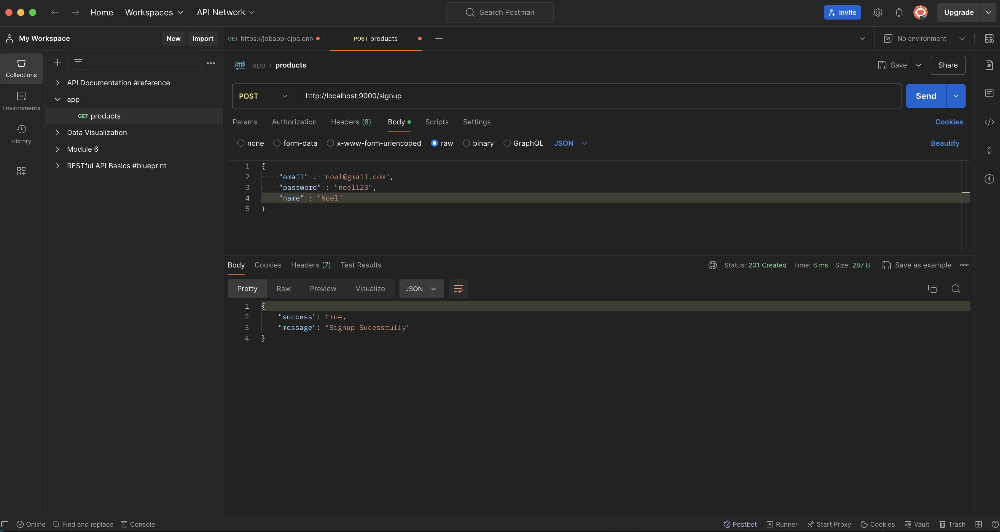
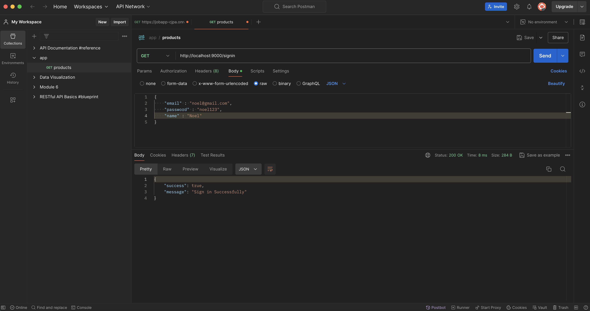
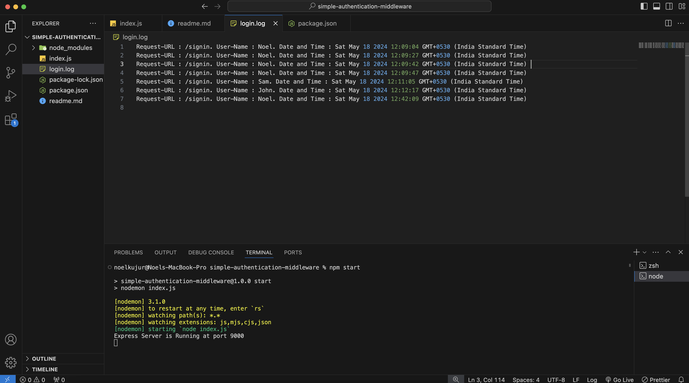

# User Authentication API (Middleware)

This is a simple Node.js application using the Express framework to handle user sign-up and sign-in with in-memory storage. It includes basic authentication middleware and logs user sign-in attempts to a file.

### ScreenShorts

- Sign-up



- Sign-in



- Logs



## API Endpoints

### Sign-up (POST)
- URL: `/signup`
- Method: POST
- Description: Registers a new user.

- Request Body:
```json
{
    "name": "Noel",
    "email": "noel@gmail.com",
    "password": "noel123"
}
```

- Response:
    - Success:
    ```json
        {
            "success": true,
            "message": "Signup Successfully"
        }
    ```

### Sign-in (GET)
- URL: /signin
- Method: GET
- Description: Authenticates an existing user.

- Request Body:
```json
    {
        "email": "noel@gmail.com",
        "password": "noel123"
    }
```

- Response:
    - Success:
    ```json
        {
            "success": true,
            "message": "Signup Successfully"
        }
    ```

    - Error:
    ```json
        {
            "success": false,
            "error": "INVALID CREDENTIALS (Middleware error)"
        }
    ```

## Undefined Path Handler
- URL: /*
- Method: ALL
- Description: Handles undefined paths.

- Response:
```json
{
    "success": false,
    "error": "Path Not Found"
}
```
## Middleware
 
- Authentication Middleware: Verifies user credentials and logs the sign-in attempts.

```javascript
function authenticationMiddleware(req, res, next) {
    const userExist = userData.find(elem => req.body.email === elem.email && req.body.password === elem.password);
    if (userExist) {
        fs.appendFileSync("login.log", `Request-URL : ${req.url}. User-Name : ${req.body.name}. Date and Time : ${new Date()} \n`);
        next();
    } else {
        res.status(404).json({
            success: false,
            error: "INVALID CREDENTIALS (Middleware error)"
        });
    }
}
```

### Logging
- Sign-in attempts are logged in the `login.log `file with the following format:

```sql
Request-URL : /signin. User-Name : Noel. Date and Time : Sat May 18 2024 12:09:47 GMT+0530 (India Standard Time)
```

## Notes
- This example uses in-memory storage for user data. In a production environment, you should use a database to store user credentials securely.

- Ensure that passwords are hashed and not stored in plain text for security reasons.

## License
This project is licensed under the MIT License. See the LICENSE file for details.

## Acknowledgments
- `Express` - The web framework used.
- `Node.js` - JavaScript runtime.